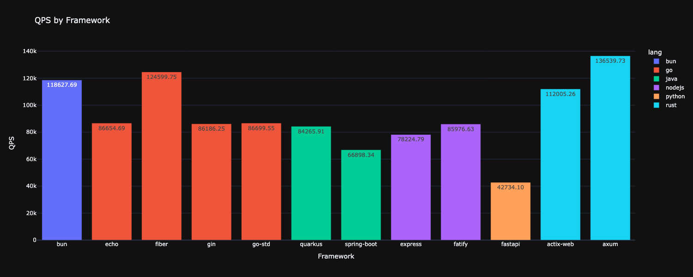
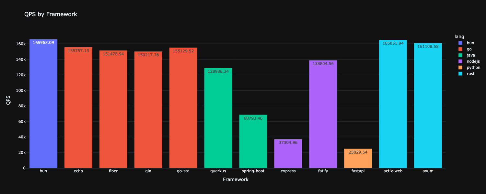

# Benchmark 2026 0106

## requirement
    rust for actix-web axum
    go for std echo gin fiber
    nodejs & npm for express fastify
    python & uv for fastapi
    bun for bun
    java maven gradle for spring boot quarkus
    mise tool to run recipes in mise.tool
    wrk to run load test

## steps to run test
    1. run `mise build-XXX` to build or install dependencies
    2. run `mise run-XXX` to run http server in specific language and framework
    3. run `mise run-benchmark` in another terminal to run test

## run all benchmark and gen result chart image
    1. run `mise build-all` to build and install dependencies
    2. run `cd tools && cargo run -r -- run-benchmarks` to generate results.png

## Result

### Macos

### test platform info

    OS: macOS 15.7.3 24G419 arm64
    Kernel: 24.6.0
    CPU: Apple M2 Pro
    Memory: 32GiB

### software versions

    Rust 1.92.0 (344c4567c 2025-10-21)
    go version go1.25.5 darwin/arm64
    Python 3.13.3
    Nodejs v22.21.1
    Bun 1.3.5
    openjdk 25.0.1 2025-10-21
    OpenJDK Runtime Environment Homebrew (build 25.0.1)
    OpenJDK 64-Bit Server VM Homebrew (build 25.0.1, mixed mode, sharing)

### Linux

### test platform info

    OS: Debian GNU/Linux 13 (trixie) x86_64
    Kernel: 6.12.43+deb13-amd64
    CPU: Intel i7-8700 (12) @ 4.600GHz
    Memory: 32GiB

### software versions

    Rust 1.92.0 (344c4567c 2025-10-21)
    go version go1.25.5 linux/amd64
    Python 3.13.3
    Nodejs v22.21.1
    Bun 1.3.5
    openjdk version "25.0.1" 2025-10-21 LTS
    OpenJDK Runtime Environment Temurin-25.0.1+8 (build 25.0.1+8-LTS)
    OpenJDK 64-Bit Server VM Temurin-25.0.1+8 (build 25.0.1+8-LTS, mixed mode, sharing)

## Automated Benchmarking

We've added Rust-based automation tools to run benchmarks and generate charts automatically:

- Navigate to the `tools/` directory
- Use `cargo run -- run-benchmarks` to run all benchmarks automatically
- Use `cargo run -- run-benchmark -f <framework>` to benchmark a specific framework
- Results are saved to JSON files and charts are automatically generated